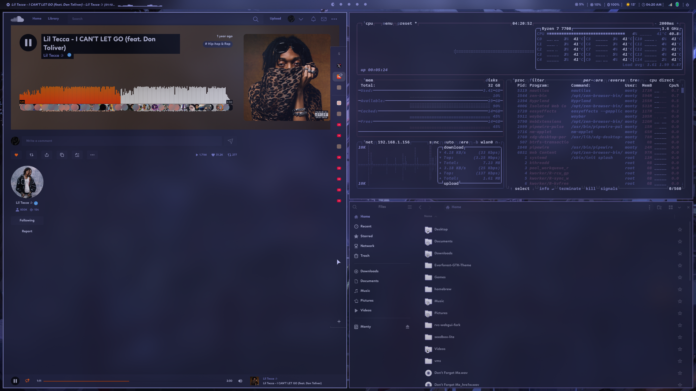

Welcome to my custom Hyprland configuration.

Before using this configuration ensure you are using Arch.

Though, i might adapt it  to other distros '(Highly unlikely though)'.
        
Getting Started.

    Clone the repository: git clone https://github.com/LongLivTheHustle/Hypr-Dotfiles.git
    $ cd Hypr-Dotfiles
    $ chmod +x install.sh
    $ $HOME/Hypr-Dotfiles/install.sh

When it is finished  exit your TTY session and restart your sysetem.

Video Coming Soon... 

